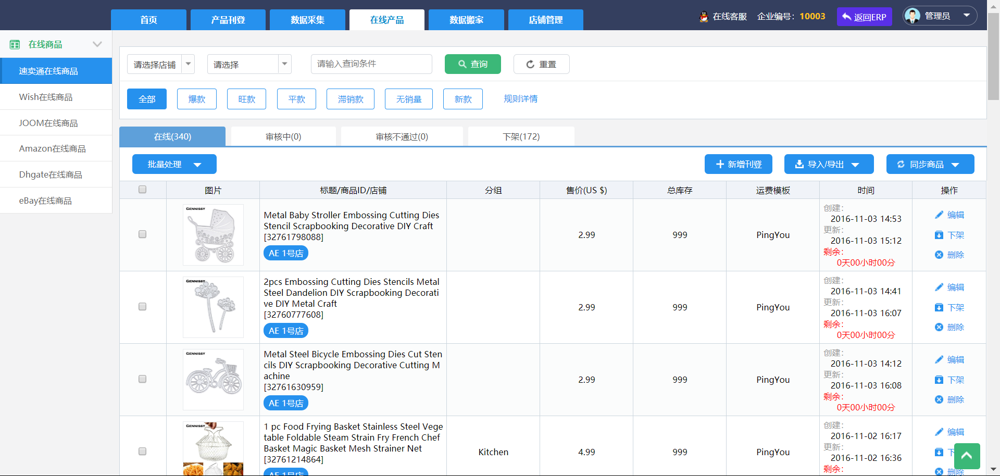
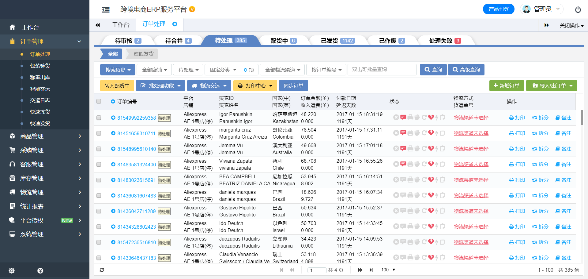

# 跨境电商ERP：
跨境电商ERP，跨境电商erp系统：亚马逊erp，对接亚马逊、wish、ebay、速卖通、shopify、shopee虾皮、lazada等跨境电商平台。跨境电商ERP源码，跨境电商erp系统源码：亚马逊erp源码、wish erp源码、ebay erp源码、速卖通erp源码、shopify erp源码、shopee虾皮erp源码、lazada来赞达erp源码。对接亚马逊、wish、ebay、速卖通、shopify、shopee虾皮、lazada等跨境电商平台源码，跨境电商erp源码。 

## 演示地址（合作）
联系邮件：194105026@qq.com 
微信：194105026（申请备注"github跨境电商ERP"） 

## 1、架构：
后端使用spring boot2.0 + 前端vue.js架构。使用的技术栈：java开发、shiro权限认证、maven模块化管理、quartz定时任务、logback日志、alibaba druid主备数据库连接多数据源配置、thymeleaf模板引擎、i18n国际化、jackson json数据处理、devtools热处理、mybatis数据层持久化层、pagehelper mybatis分页、一级缓存使用ehcache二级缓存使用redis、apache POI处理excel等offic办公软件、Velocity模板根据表自动生成controller、service、mapper、mapper xml文件、后台html代码便于快速开发。 
后台管理界面：bootstrap、layui、bootstrap-table、bootstrap-treegrid、bootstrap-datetimepicker、bootstrap、summernote富文本编辑器、fontawesome字体、select2下拉框组件。 
客户前端界面：vue.js+elementui。axios、vuex、vuedraggable、element-ui、webpack、echarts、font-awesome、js-base64、qrcode、screenfull、summernote、jquery、支持美图秀秀在线美图。 
## 2、安全性：
防止XSS攻击、传输数据使用SHA-1/MD5、RSA加密解密、前端请求接口后台使用拦截器做token认证。易用性：便于开发者快速设计开发、设计好表以后即可自动导出源码，用户界面友好易操作。 
## 3、对接物流：
云途物流、对接equick国际物流、对接燕文物流。 
## 4、对接翻译：
百度翻译、必应翻译、有道翻译、阿里翻译。 
## 5、UPC&EAN：
对接surtime在线接口。 
## 6、产品采集：
使用chrome采集插件采集淘宝、天猫、京东、1688、速卖通、亚马逊等国内电商平台。 
## 7、亚马逊mws接口对接：
已开发完认证接口、产品listing刊登变体上传、订单同步、订单发货等功能。 
## 8、shopee接口对接：
已开认证接口、发产品信息、变体信息刊登、在线商品同步、订单同步、订单发货等信息。 
针对亚马逊MWS漏桶算法的频率限制，已使用解决方案完美处理。
## 9、shopify接口。
独立站
亚马逊ERP、wishERP、ebayERP、速卖通ERP、shopifyERP、shopeeERP、虾皮ERP、lazadaERP
## 开发环境
统一使用STS版本作为开发工具，JDK使用1.8，Maven使用3.2;
## 演示效果图

